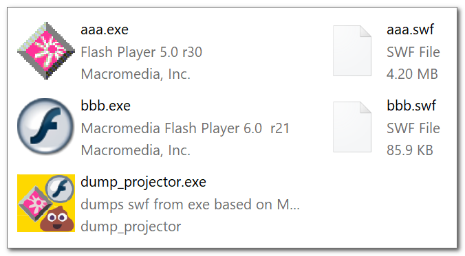

<h1> dump_projector_bin</h1>  
  
extract `swf` from a "projector" exe (a Macromedia/Adobe Flash player).  
  
  
  
  

  
  
<hr/>  
<hr/>  

note:  

  

avast, and virustotal will give a false-positive `Win32:Evo-gen [Trj]` and `Trojan.Win32.Rozena`  
https://www.virustotal.com/gui/file/5c69ce261955ebd944a50c4c1bd583df3584ab391d3c022a50070df6b3a8681d?nocache=1  

the source is attached, just built it yourself. :  
`sudo apt-get -y install build-essential mingw-w64`, `i686-w64-mingw32-gcc -o dump_projector.exe dump_projector.c`  

it also means your anti-virus will sandbox the file when you'll try to extract it from the zip.  

<hr/>  
<hr/>  
  
back in the days,  
you've simply created a new file then dumped the bytes of a flash player  
of your choice, after that, you've dumped your swf,  
then wrote a magic `0xFA123456` (`56 34 12 FA`), followed by the file size.  
  
you could have repeated the process to "embed" as much swf files as needed.  
when launched the exe, it was very simply dumped the file to a tmp. file,  
or launched it from RAM. nothing fancy like an embedded resource or even a checksum..  
  
this program pretty much locates that "magic" and file size and cuts those bytes and writes them to a file.  
it is based on https://github.com/laenion/dump_projector/commit/e71b540c84f6efe43c2af65033f3044cf0ac535b  
version is date-based `2018-12-08T21:43:25Z` is `v2018.12.08.2143`  
  
<hr/>  
  
run:  
  
for linux: `chmod u+x dump_projector.run`, `./dump_projector.run aaa.exe aaa.swf`  
for Windows: `"dump_projector.exe" "aaa.exe" "aaa.swf"`  
  
if you don't want any output redirect the `STDOUT` and `STDERR` to `/dev/null` in linux, or `NUL` in Windows,  
using `1>` and `2>`  
exit code (`$?` linux, `%ErrorLevel%` Windows) is `0` (success), or `1` (failed).  
  
  
<hr/>  
  
built on linux using cross-os mingw-64 which works fine on Windows.  
it has an additional manifest, version-info, and an icon to make it Windows 10/11 compatible.  
  
it works on a single file, but you can write a script that loops through all the `exe` (or whatever files really) in a folder.  

<hr/>

say you've placed the program under `D:\Software\dump_projector.exe`,  
and you've got a ton of such exe files on your desktop (or something..)  

just to be safe, 
move all those "flash" exe files to a folder on their own,  
create a new blank file named `process_all_exe_files_in_this_folder.cmd`  
and copy paste the following code in to it (don't forget to adjust the placement of `dump_projector.exe`)  

```cmd
@echo off
chcp 65001 1>nul 2>nul

pushd "%~sdp0"

for %%x in (*.exe) do ( 
  call :METHOD__GENERIC %%x
)

goto END

::-------------------------------------

:METHOD__GENERIC
  "D:\Software\dump_projector.exe" "%~f1" "%~sdp1%~n1.swf" 1>nul 2>nul
  set "EXIT_CODE=%ErrorLevel%"

  if ["%EXIT_CODE%"] EQU ["0"] (
    echo [INFO] v  %~nx1 » %~n1.swf  1>&2
  ) else (
    echo [INFO] x  %~nx1 X %~n1.swf  1>&2
  ) 
  goto :EOF

::-------------------------------------

:END
  echo. 1>&2
  pause 1>&2
  popd
  exit /b 0
```

you'll get a file in the same name (with `.swf` extension),  
and a minimal output.  

the script isn't "digging deep" into the folder tree,  
so you'll have to place them all in the same folder.  

TIP:  
if you've downloaded an old archive, ISO, etc..  
place your file in a new folder and use 7zip with `7z e yourfile`  
(not `7z x yourfile`) it will ignore the folder structure and simple extract all the files into the same folder.  
you can use https://github.com/eladkarako/7z_bundle which supports some more formats..

<hr/>

just to be clear, it does NOT run the exe file, it just copy their bytes.
  
<hr/>  
  
note:  
  
if you're using a hex-editor you'll have to look for the least-significant byte first,  
I.E. `56 34 12 FA`. after that you've wrote the file length.  
  
<hr/>  
  
note:  
you can use https://github.com/superman2211/guepard  
to extract most of the resources from the swf, which is better starting point for converting it to normal HTML5/js/css/canvas (if you so wish).  
you can also use https://github.com/ruffle-rs/ruffle to run their Rust-based swf-emulator, that can be embedded into a web-page using web-assembly, and run the swf as is.  
  
  
